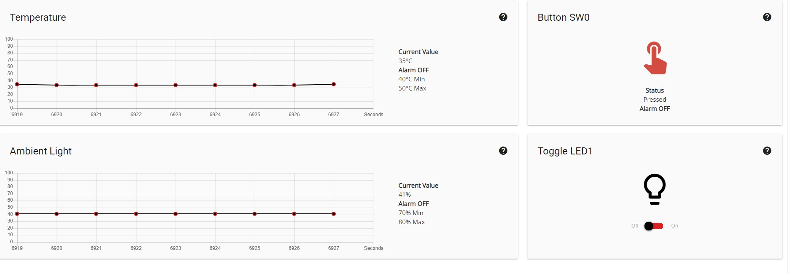

# STM32 lwip web interface

This is a project based on STM32F769-disco board. The project uses FREERTOS and lwip and SDIO plus dma to implement. The SD card files are stored in SD_Card_files.zip and I put it on release section. In fact, the project port the 'Advanced Web Server Application' from SAM E54 to my board. In the this board, there is no light sensor, so I make a progress bar widget on the screen to simulate the light sensor input. In the program, you have to make sure that lwip can create different threads, because for modern browser, they use different threads to request files at the same time, if you do not use multi threads to response to requests, the browser will regard this as package lost.

## Picture of Demo

    
     
    
Web Server Screenshot

    
     
    
Board Screen

## Explanation

When you press the user button on the board (blue one), and you will see the __Button SW0__ on the web becomes on. And when __Toggle Led__ is toggle, you will see LD1 on the board will turn on or off. the board also sends chip temperature to the client, so the browser can draw a line curve.

## Flow chart

